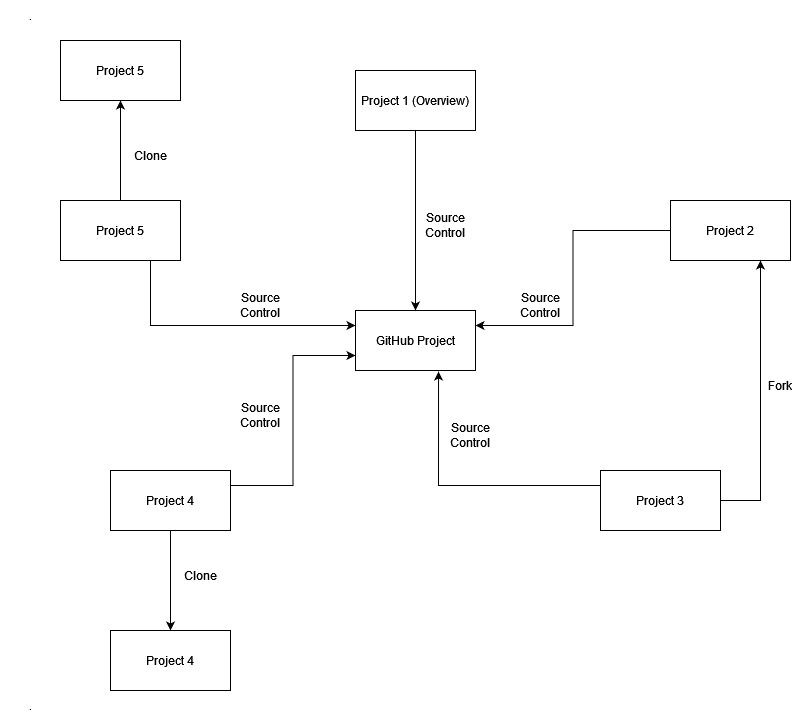

# CMPG-323-Overview---33768080
This is my project for the subject CMPG 323.

Repositories:

Kanban Project - CMPG 323 Kanban Project - URL - https://github.com/users/Boskrag/projects/1/views/2
Project 1 - CMPG 323 Overview 33768080 - URL - https://github.com/Boskrag/CMPG-323-Overview---33768080
Project 2 - CMPG 323 Project 2 33768080 - URL -
Project 3 - CMPG 323 Project 3 33768080 - URL -
Project 4 - CMPG 323 Project 4 33768080 - URL -
Project 5 - CMPG 323 Project 5 33768080 - URL -

Project and repository context and how they are integrated:

All projects will have there own repository, but will share the same Kanban project on Github which will undergo version control and be regularly updated.
Thus there will be 5 repositories and 1 Kanban Project.

Branching Strategy to be useds within each project :
See Word document in Github repository for Diagram, since notepad only supports text.

The branching strategy I will be using is, Flow Branch Strategy.
The primary branch of GitHub flow houses your code that is prepared for production.
When the work is finished and properly reviewed, the other branches,known as feature branches, will be merged back into the main branch.
These branches should contain work on new features and bug fixes.
This Git branching technique supports Continuous Delivery and Continuous Integration due to the workflow's simplicity,
however it isunable to support several versions of the code running concurrently in production.
https://www.gitkraken.com/learn/git/best-practices/git-branch-strategy.14/8/2022

The use of .gitignore within each project:
In order to instruct Git which files and directories to ignore when you make a commit,
you can create a.gitignore file in the root directory of your repository.
https://docs.github.com/en/get-started/getting-started-with-git/ignoring-files.14/8/2022

Git's gitignore file is crucial because it prevents unnecessary files
from being added to version control. Thus it will be used, when
working on projects, to ensure that only the necessary files are committed.

The storage of credentials and sensitive information :
Credentials and sensitive information will be stored in
the repositories, using encrypted secrets.
You can create secret environment variables in a repository, organization, or repository environment.
To help ensure that secrets are encrypted before they reach GitHub and
remain encrypted until you utilize them in a process, GitHub uses libsodium sealed boxes.
https://docs.github.com/en/actions/security-guides/encrypted-secrets..14/8/2022

